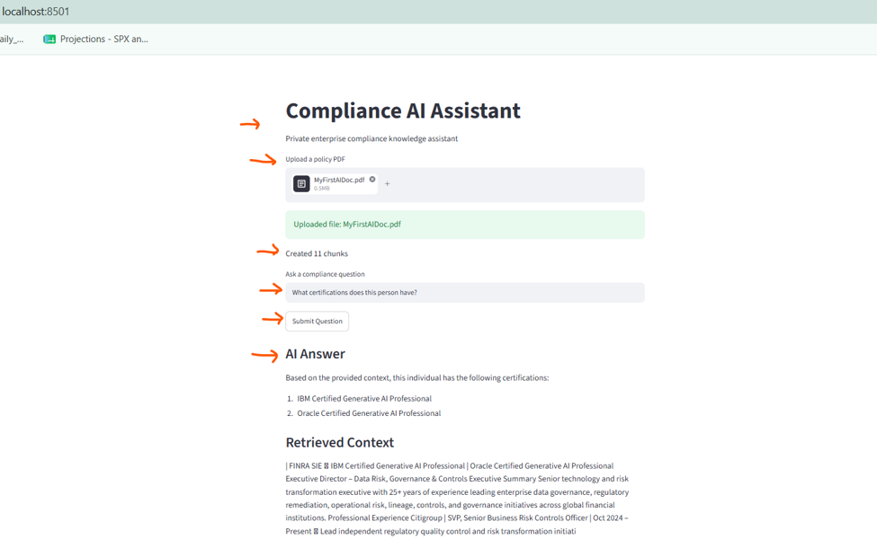
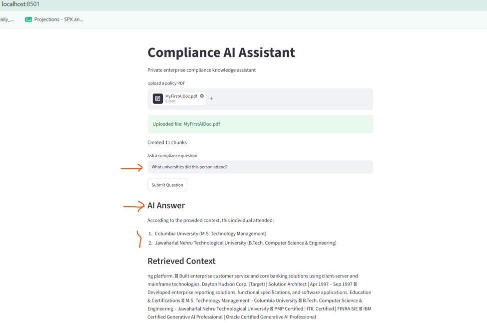
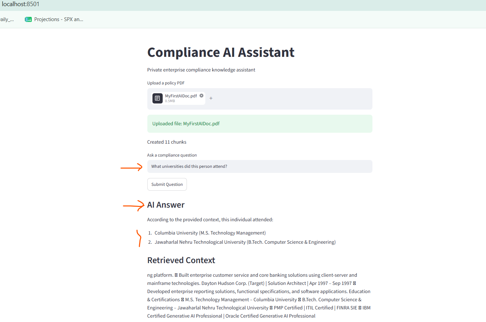

# Private Enterprise AI Assistant (RAG)

A private enterprise Retrieval-Augmented Generation (RAG) assistant built using Python, Streamlit, ChromaDB, Sentence Transformers, and local LLMs via Ollama.

This application demonstrates how organizations can securely search and interact with internal policy documents, governance procedures, compliance manuals, and enterprise knowledge bases without exposing data to external cloud AI providers.

## Features

* Private/local AI inference using Llama3 via Ollama
* PDF document upload and ingestion
* Semantic search using embeddings
* Chroma vector database integration
* Retrieval-Augmented Generation (RAG)
* Enterprise-style compliance assistant workflow
* Local/offline architecture (no external LLM APIs required)
* Streamlit-based web UI

## Technology Stack

* Python
* Streamlit
* ChromaDB
* Sentence Transformers
* Ollama
* Llama3
* PyPDF

## Architecture Overview

1. User uploads enterprise PDF documents
2. PDF text is extracted and chunked
3. Embeddings are generated using Sentence Transformers
4. Chunks are stored in ChromaDB vector database
5. User submits a natural language question
6. Semantic retrieval identifies relevant document chunks
7. Retrieved context is sent to local Llama3 model
8. AI-generated response is returned to the user

## Example Use Cases

* Insider trading policy assistant
* Compliance procedure search
* Governance knowledge retrieval
* Enterprise policy Q&A
* Internal audit support
* Regulatory documentation assistant

## Future Enhancements

* Multi-document retrieval
* Role-based access controls
* Source citations and page references
* Chat history and memory
* Enterprise authentication (SSO/Azure AD)
* Docker and Kubernetes deployment
* API integration layer

## Screenshots

(Add screenshots here)

## Disclaimer

This project is intended for educational and enterprise architecture demonstration purposes only.
